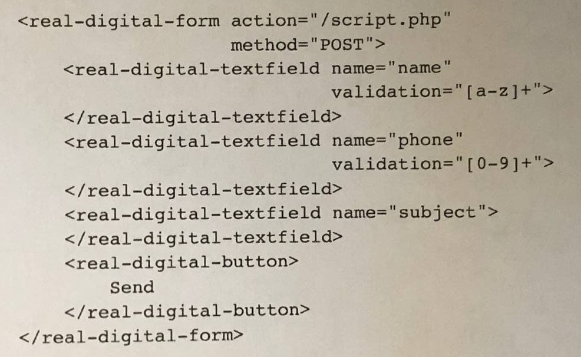

# real-digital forms-task

## Content

```
A series of Vue.js components that can send user-entered data to a server (http://httpbin.org).

Task: Example snippet below should work as described after implementation.
```

<br>

## Project setup

```
npm install
```

### Compiles and hot-reloads for development

```
npm run serve
```
